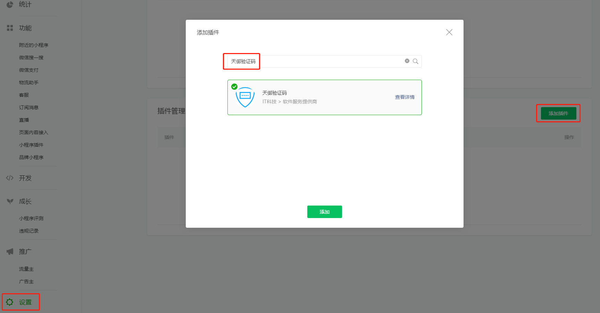

# 插件式接入

## 添加插件

用管理员身份登录微信公众平台，请使用需要接入小程序的相关账号，依次点击：设置-第三方设置-添加插件。

输入关键字“xxx”并搜索，点击添加，如下图：



## 集成插件

声明插件：在 app.json 中声明插件

```json
{
  "plugins": {
    "myPlugin": {
      "version": "1.0.0",
      "provider": "wxc63208fc8b754ae1"
    }
  },
  "functionalPages": {
    "independent": true
  },
}
```

## 使用插件

### 跳转到插件页面

```js
wx.navigateTo({
  url: 'plugin://myPlugin/hello-page'
});
```

### 引入插件的提供的组件

```json
{
  "usingComponents": {
    "hello-list": "plugin://myPlugin/hello-component"
  }
}
```

```html
<hello-list items="{{ items }}" />
```
